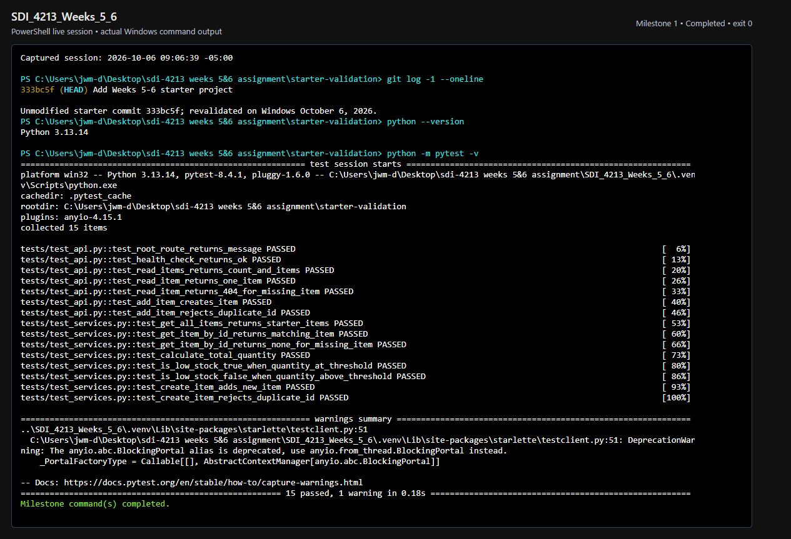
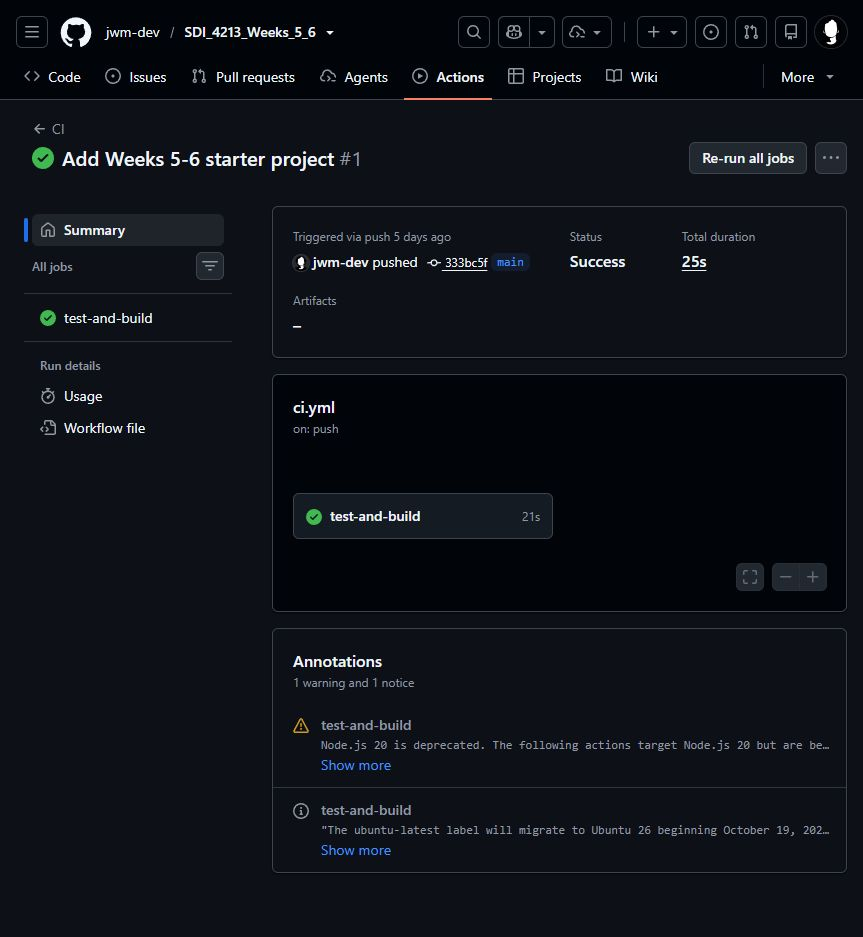
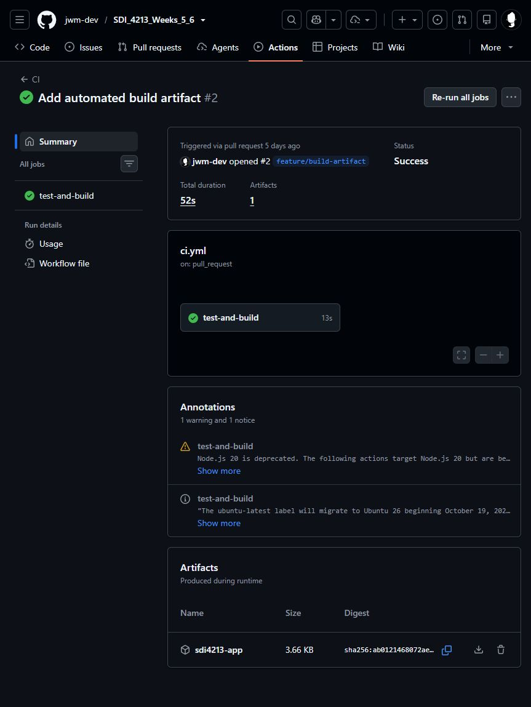
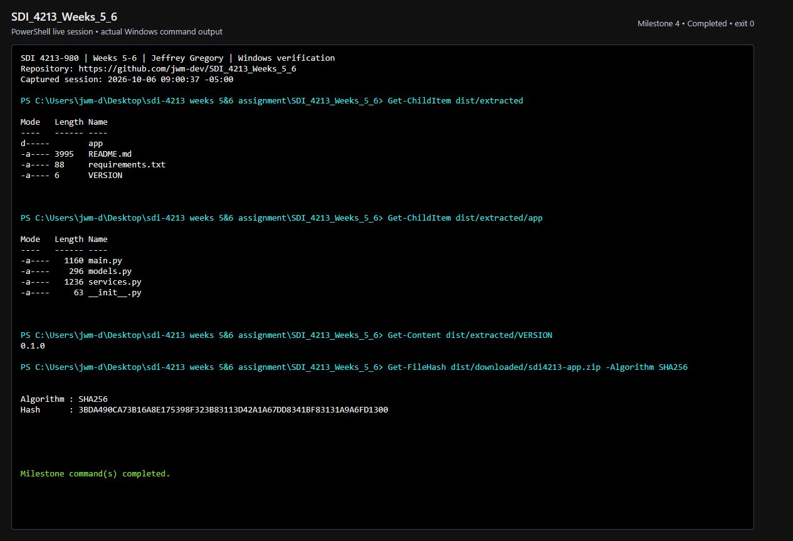
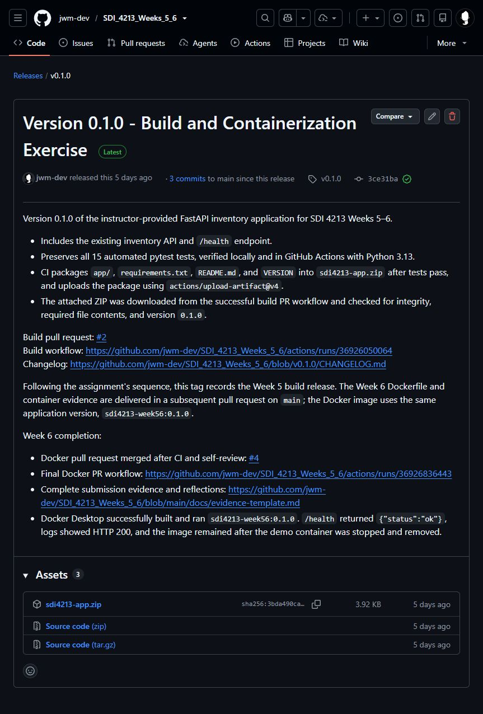
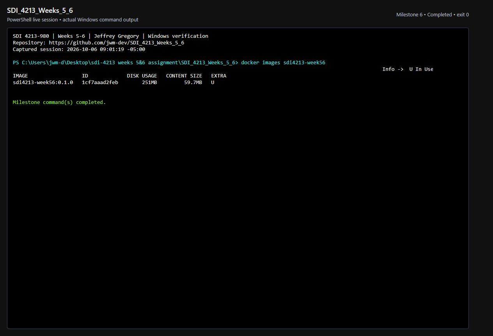
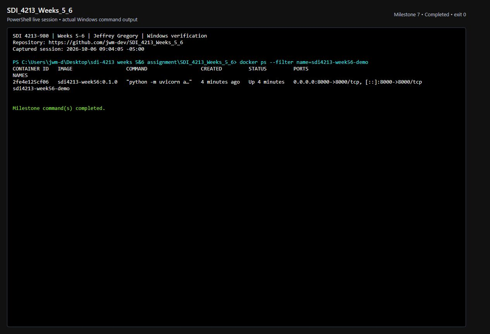
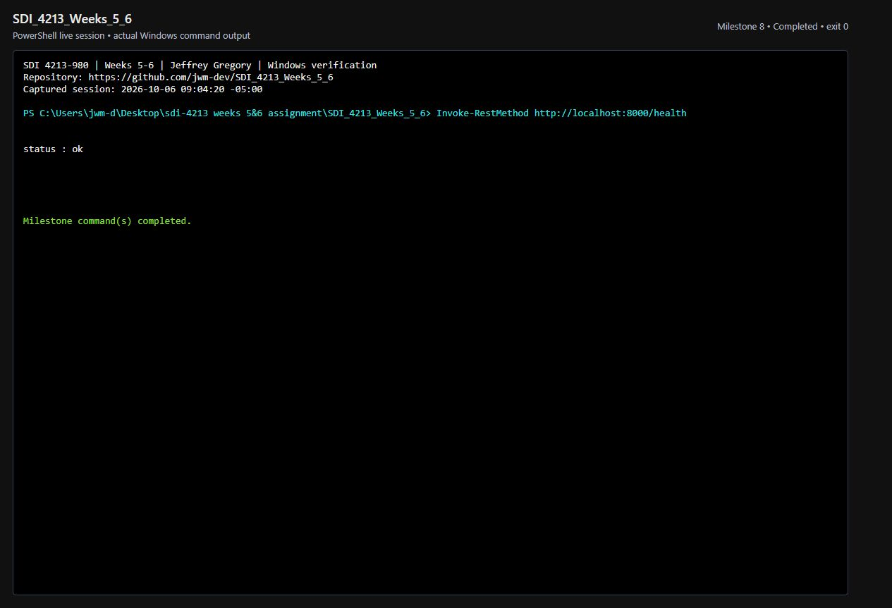
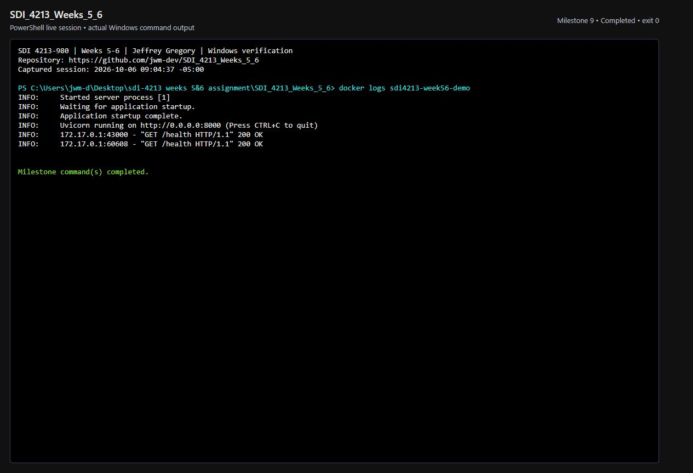
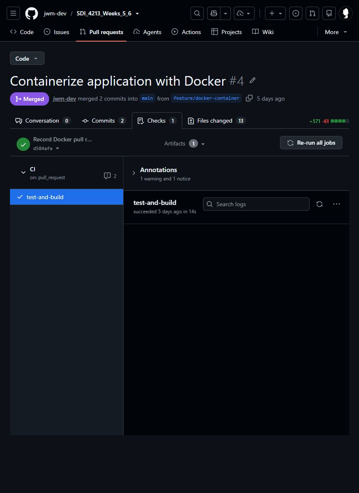

# Weeks 5-6 Exercise Evidence

**Name:** Jeffrey Gregory
**Course:** SDI 4213-980 - DevOps: CI/CD
**Assignment:** Build, Release, and Containerize an Application
**Windows verification:** October 6, 2026 (America/Chicago)
**Repository:** https://github.com/jwm-dev/SDI_4213_Weeks_5_6

## Completion and provenance

The instructor's FastAPI app, all 15 tests, requirements, and `VERSION` are
unchanged from initial commit `333bc5f`. The build and Docker pull requests were
merged and the release published October 1. Existing work was verified and its
missing screenshots completed on Windows October 6 with tool and AI assistance.
[The original evidence record](evidence-2026-10-01.md) preserves the earlier
macOS command evidence.

All screenshots were captured October 6 from this authenticated GitHub account
or an actual Windows PowerShell session. Terminal screenshots show a local
xterm terminal backed by a real PowerShell pseudo-terminal, with executed
commands and actual output. Milestone 1 revalidates a separate checkout of the
unmodified starter; it is not an October 1 screenshot. GitHub captures show the
original runs, release, and merged PR. No credentials are included.

## Links and versions

| Requirement | Evidence |
| --- | --- |
| Repository | https://github.com/jwm-dev/SDI_4213_Weeks_5_6 |
| Baseline CI | https://github.com/jwm-dev/SDI_4213_Weeks_5_6/actions/runs/36925881257 |
| Build issue #1 | https://github.com/jwm-dev/SDI_4213_Weeks_5_6/issues/1 |
| Build PR #2 | https://github.com/jwm-dev/SDI_4213_Weeks_5_6/pull/2 |
| Build artifact CI | https://github.com/jwm-dev/SDI_4213_Weeks_5_6/actions/runs/36926050064 |
| Git tag | `v0.1.0` at `3ce31ba11345e24e077f86df9331092d176aaf06` |
| GitHub Release | https://github.com/jwm-dev/SDI_4213_Weeks_5_6/releases/tag/v0.1.0 |
| Docker issue #3 | https://github.com/jwm-dev/SDI_4213_Weeks_5_6/issues/3 |
| Docker PR #4 | https://github.com/jwm-dev/SDI_4213_Weeks_5_6/pull/4 |
| Docker PR CI | https://github.com/jwm-dev/SDI_4213_Weeks_5_6/actions/runs/36926836443 |
| VERSION | `0.1.0` |
| Image | `sdi4213-week56:0.1.0` |
| Container | `sdi4213-week56-demo` |

## Verification results

- Python **3.13.14** locally; **15 tests passed** in the unmodified starter
  and completed project. One dependency deprecation warning, no failures.
  `python -m pip check`: no broken requirements.
- CI triggers: pushes to `main`, pull requests targeting `main`. Runner:
  `ubuntu-latest`. `actions/setup-python@v5` selects Python 3.13 and pip caching.
  CI upgrades pip, installs requirements, and runs `python -m pytest -v`.
- After passing tests, CI creates `dist/package`, copies `app/`, requirements,
  README, and VERSION, and creates `dist/sdi4213-app.zip`.
  `actions/upload-artifact@v4` uploads `sdi4213-app` with 90-day retention.
  Failed tests prevent packaging and upload.
- Downloaded the real build-PR artifact with `gh run download`, extracted the
  inner ZIP with `Expand-Archive`, checked ZIP integrity, required contents,
  version `0.1.0`, and byte-for-byte equality to build commit `383877f`.
  ZIP SHA-256: `3bda490ca73b16a8e175398f323b83113d42a1a67dd8341bf83131a9a6fd1300`.
- Release title: **Version 0.1.0 - Build and Containerization Exercise**.
  Notes describe the API, tests, and automated ZIP. The verified ZIP is attached
  as an asset. Following the assignment sequence, the release tag precedes the
  Docker PR; app code and version remain unchanged.
- Both required PRs passed CI before merge and contain self-review records.
  GitHub prevents authors from approving their own PRs; these are self-review
  comments, not independent approvals.
- Windows Docker Desktop **4.53.0**, Engine **29.0.1**, Compose
  **v2.40.3-desktop.1**, context `desktop-linux`, Linux/amd64.
  `docker --version`, `docker compose version`, and
  `docker run --rm hello-world` passed before building the course image.
- Docker initially failed on inaccessible runtime sockets. Affected socket
  directories were renamed to preserve backups, and Desktop started. No WSL
  distribution was unregistered during this repair.
- Dockerfile: `python:3.13-slim`, `/app`, requirements copied and installed
  before `app/`, `EXPOSE 8000`, Uvicorn bound to `0.0.0.0:8000`.
  `.dockerignore` excludes all eight required patterns and development files.
- `docker build --progress=plain -t sdi4213-week56:0.1.0 .` succeeded.
  Image ID: `sha256:1cf7aaad2feb08b59f5205f116655ea8d1664d61e45551256037039c61adee14`.
- Ran `docker run -d -p 8000:8000 --name sdi4213-week56-demo sdi4213-week56:0.1.0`.
  Container ID begins `2fe4e125cf06`. `docker ps` confirmed image, name,
  running state, and port mapping.
- `Invoke-RestMethod http://localhost:8000/health` returned **status: ok**.
  Logs show Uvicorn startup and `GET /health HTTP/1.1` **200 OK**.
- Container Python **3.13.16**; `pip check` found no broken requirements.
  Local and image interpreters both use Python 3.13; patch versions differ
  because the slim image was resolved at build time.
- Stopped and removed the demo container; `docker ps -a` confirms its absence.
  The same image remains available. [Raw Windows evidence](evidence/windows)
  includes setup, build, command sessions, and image metadata.

## Screenshots in assignment order

### Milestone 1 - Local tests

Milestone 1 - Starter tests pass locally before modifications.

Command: `python -m pytest -v` at unmodified starter `333bc5f`; revalidated
October 6, **15 passed**.

### Milestone 2 - Baseline CI

Milestone 2 - Baseline GitHub Actions CI workflow passes.

Run: https://github.com/jwm-dev/SDI_4213_Weeks_5_6/actions/runs/36925881257

### Milestone 3 - Build artifact

Milestone 3 - CI created and uploaded the build artifact.

Run: https://github.com/jwm-dev/SDI_4213_Weeks_5_6/actions/runs/36926050064

### Milestone 4 - Extracted artifact

Milestone 4 - Downloaded artifact contains the required release files.

Commands: `Get-ChildItem dist/extracted`, `Get-ChildItem dist/extracted/app`,
`Get-Content dist/extracted/VERSION`, and `Get-FileHash` for the downloaded ZIP.

### Milestone 5 - Release

Milestone 5 - Versioned GitHub Release v0.1.0 published.

Release: https://github.com/jwm-dev/SDI_4213_Weeks_5_6/releases/tag/v0.1.0

### Milestone 6 - Docker image

Milestone 6 - Versioned Docker image built successfully.

Command: `docker images sdi4213-week56`; image `sdi4213-week56:0.1.0`.

### Milestone 7 - Running container

Milestone 7 - Container is running and port 8000 is published.

Command: `docker ps --filter name=sdi4213-week56-demo`.

### Milestone 8 - Health

Milestone 8 - Containerized application health check succeeds.

Command: `Invoke-RestMethod http://localhost:8000/health`; status `ok`.

### Milestone 9 - Logs

Milestone 9 - Container logs confirm the application started and handled requests.

Command: `docker logs sdi4213-week56-demo`.

### Milestone 10 - Final PR and CI

Milestone 10 - Containerization changes passed CI and were merged through the
pull request workflow.

PR: https://github.com/jwm-dev/SDI_4213_Weeks_5_6/pull/4
Checks: https://github.com/jwm-dev/SDI_4213_Weeks_5_6/pull/4/checks

## Concepts and reflection

1. **Source, artifact, image, container:** Source is the editable project in
   Git. The retained CI ZIP packages source, requirements, README, and version;
   it requires an available Python environment and installed dependencies. A
   Docker image additionally packages the runtime, dependencies, filesystem
   layers, and startup command. A container is an instance with a process and
   writable layer. Removing the stopped container leaves the image reusable.
2. **Versions, tag, release:** VERSION states the app version. `v0.1.0` labels
   the released commit; a GitHub Release adds notes and assets. The image tag
   relates the runtime package to the same app version. Tags can move, so commit
   IDs, image IDs, and digests provide stronger identification and rollback.
3. **Port mapping:** `-p 8000:8000` sends host TCP port 8000 to container port
   8000. Uvicorn binds to `0.0.0.0` inside the container. `EXPOSE` documents a
   port but does not publish it.
4. **Repeatability and next automation:** CI applies consistent tests and
   packaging to changes. Versioned images reduce runtime differences. Next,
   automate the Docker build, vulnerability scanning, a running-container
   health check, and registry publication with a digest. Deploy that same
   digest to staging and production with approval and rollback. Replace the
   in-memory inventory with persistent storage before using replicas or relying
   on data across restarts.
